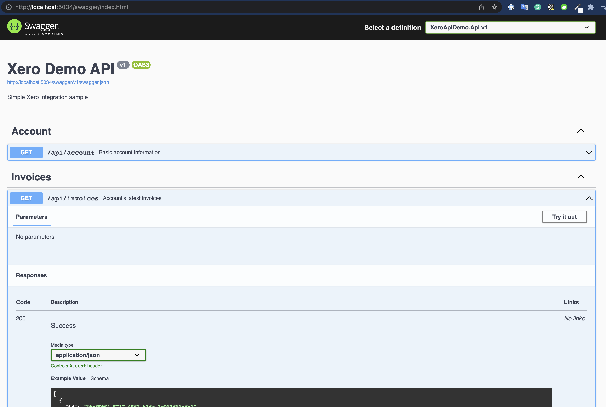
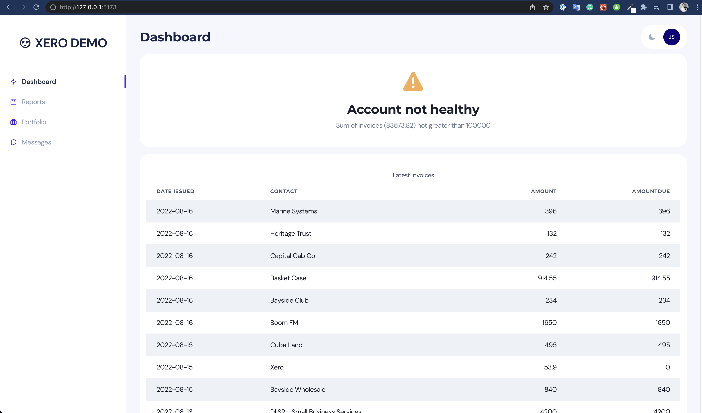
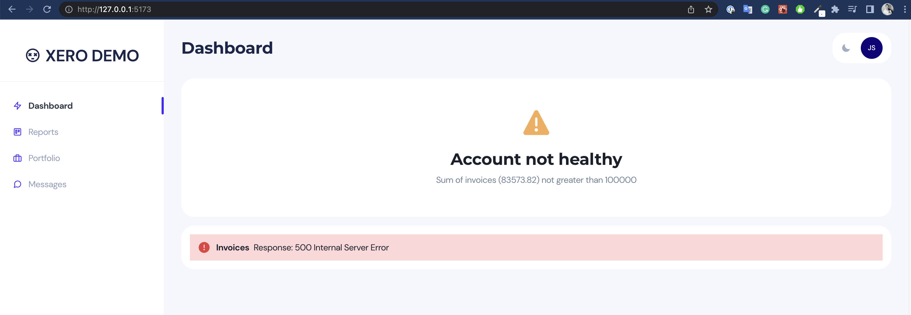
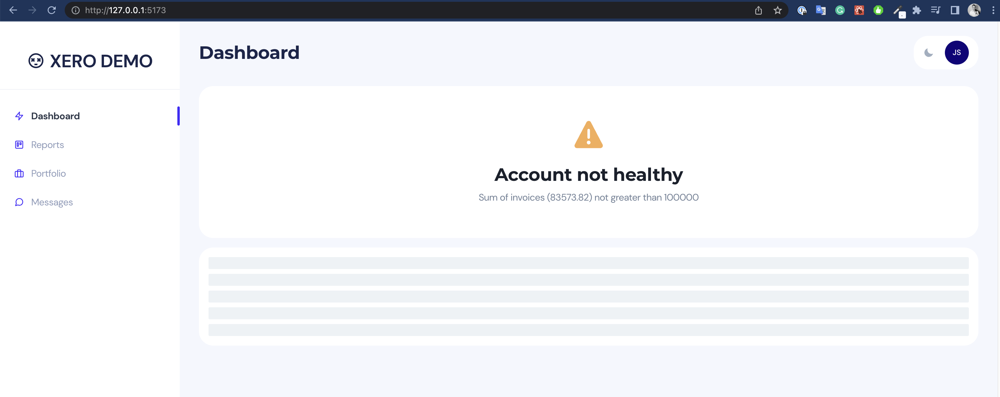

# XeroApiDemo

Sample integration with Xero Api

### Api

- .NET 6 API semi-following clean architecture
- Using in-memory EF Core
- Sample user hardcoded (accountId should come from the front-end, along with a bearer token, and validated on the backend side)
- OpenApi/Swagger page is at http://localhost:5034/swagger
- Sample user gets seeded on every startup and Hangfire job updates the invoices
- Hitting the endpoints loads data previously saved by the Hangfire job
- Added few Spec based tests for demostrative purposes

### Client

- Basic Chakra + TypeScript UI, powered by Vite
- `npm run dev` to start the local server, proxies `/api*` requests to backend
- Has dark mode 😎

